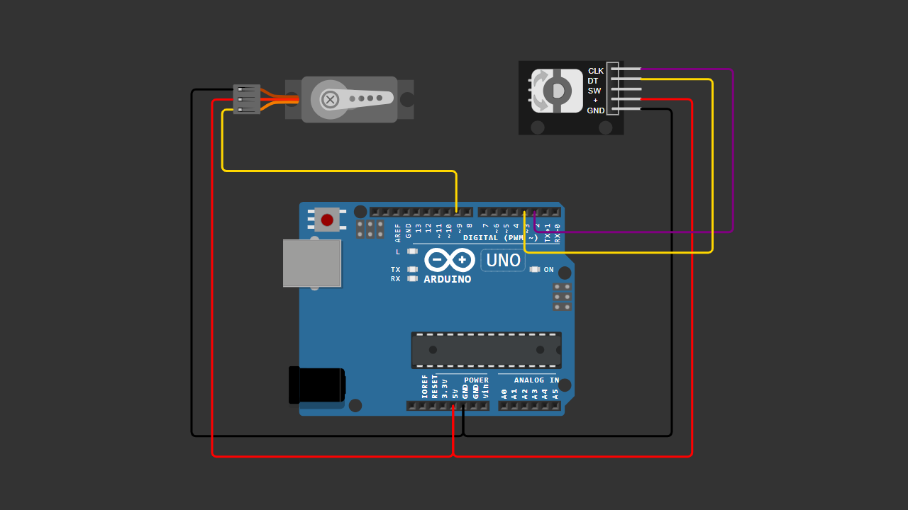

# Arduino Rotary Encoder + Servo Control

Control a servo motor (0–180°) using a rotary encoder.

Rotate clockwise  → Servo angle increases  
Rotate counterclockwise → Servo angle decreases  

---

## 🧩 Components

- Arduino Uno / Nano
- Rotary Encoder (CLK, DT)
- Servo Motor (SG90 / MG90S)
- Breadboard
- Jumper wires

---

## 🔌 Wiring Connection

| Component | Arduino Pin |
|-----------|------------|
| Rotary CLK | Pin 2 |
| Rotary DT  | Pin 3 |
| Servo Signal | Pin 9 |
| VCC | 5V |
| GND | GND |

---

## 📷 Wiring Diagram

> Make sure your wiring matches the diagram above before uploading the code.

---

## 💻 Arduino Code

You can download the Arduino sketch here:

[Download Arduino Code](Arduino_Rotary_Encoder___Servo_Control.ino)

Or open the `.ino` file directly inside this repository.

---

## 📜 How It Works

The rotary encoder detects rotation direction and updates the servo angle.  
The angle is limited between 0° and 180°.

---

## 🎥 Video Tutorial

Watch the full tutorial here:  
👉 (Paste your YouTube link here)

---

## 📄 License

This project is open-source and free to use for educational purposes.

---

Happy Coding 🚀
